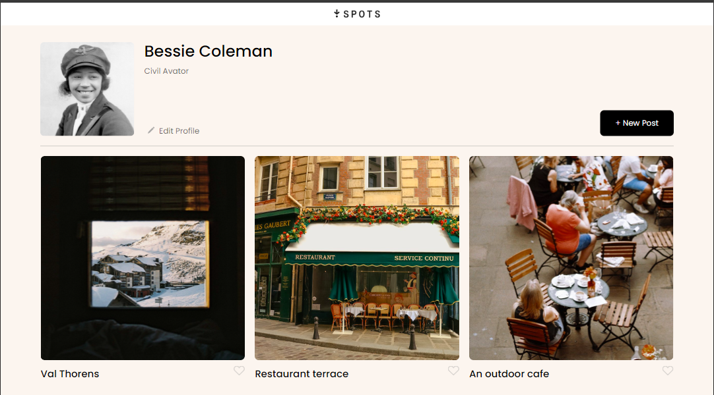
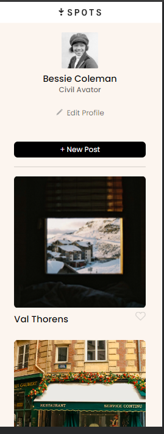

# Project 3: Se_project_spots

## A description of the project and its functionality
This is the third project of the Software Engineering program at TripleTen. It was created using HTML and CSS.
Responsive design was used to ensure the web and application contents are correctly displayed based on [Figma](https://www.figma.com/design/BBNm2bC3lj8QQMHlnqRsga/Sprint-3-Project%3A-Spots?node-id=2-60&t=X76EN5Cqn0WdoqRy-0). The layout is divided into sections including profile, images, brief descriptions and footer.

## Technologies and Techniques Used
- Flexbox layout : aligning items in a container.
- Grid layout :arranges items throughout the entire layout.
- Text Overflow with Ellipsis : Hides long text by displaying it as a limited number of lines on the screen, ending with an ellipsis.
- Setting up the fonts : Using Poppins for a better design aesthetic.

## Screenshots
- This is screenshot for desktop screen. 
- This is screenshot for mobile screen.

## Deployment
project on GitHub Pages [here](https://github.com/sun4205/se_project_spots.git)